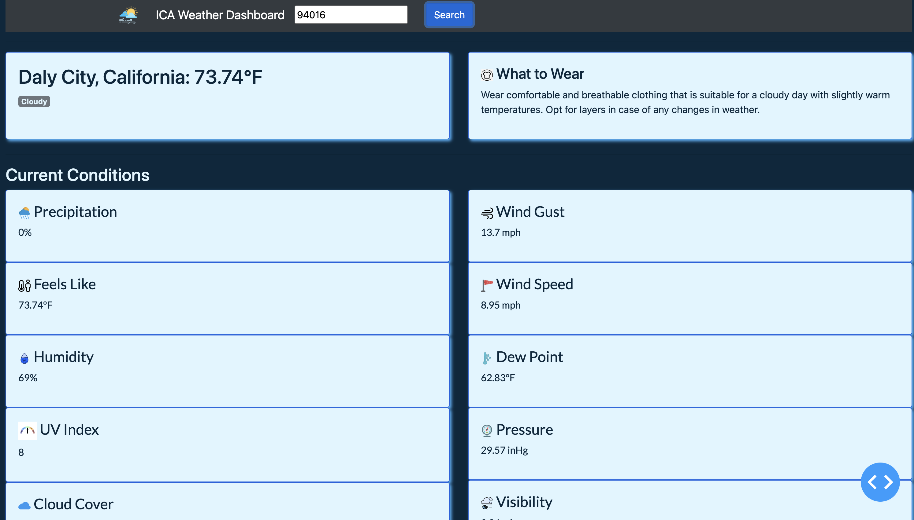
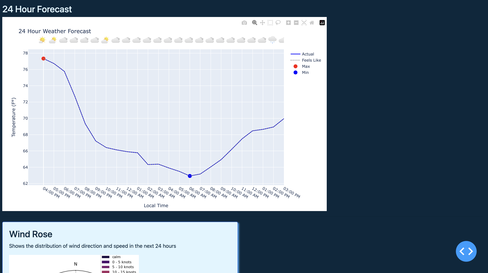

## Localized Weather Forecast Application

### Overview
The project, through its main.py script, offers a comprehensive weather insights
platform built on the Dash framework. Users receive real-time weather data and 
forecasts for their chosen locations, presented in a visually engaging dashboard. 
Beyond the standard meteorological metrics, the platform stands out by providing
AI-guided clothing recommendations based on the current conditions, addressing 
the everyday challenge of dressing appropriately for the weather.

    
    

### Files and Descriptions
1. **main.py**: The main script that orchestrates the execution of the project.
2. **api_utils.py**: Contains utility functions related to API interactions.
3. **aux_viz.py**: Auxiliary functions for visualizations.
4. **scrape_icons.py**: Script to scrape weather icons for the application.
5. **clothes.py**: Prompts generative AI API to generate appropriate clothing based on weather conditions.
6. **location.py**: provides a class that retrieves the corresponding latitude, longitude, determines the timezone, and fetches sunrise and sunset times using an external API
7. **components.py**: Defines utility functions to generate styled Card and Badge components using the Dash Bootstrap Components library
8. **weathercode.py**: weather code and description dictionary
9. In order to run script, user must have a config.py file with API Keys for Tomorrow.IO and OpenAI
                   
      

### Usage

1. Sets up a web application using Dash to provide real-time weather insights 
   and forecasts.
2. Utilizes various APIs to fetch current and forecasted weather data for a 
   specific location, which is then processed and visualized.
3. Presents the weather details in a user-friendly format, including temperature, 
   humidity, wind speed, and more.
4. Incorporates an interactive dashboard and visual components such as wind 
   roses and gauges.
5. Provides AI-driven clothing recommendations based on current weather 
   conditions.
   

